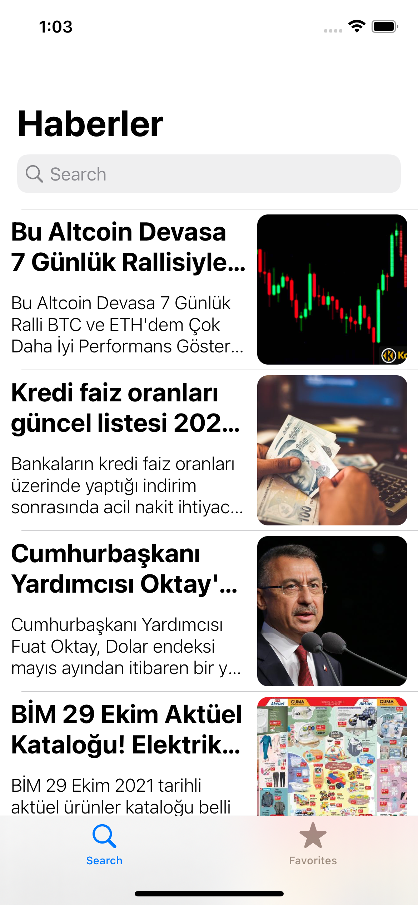
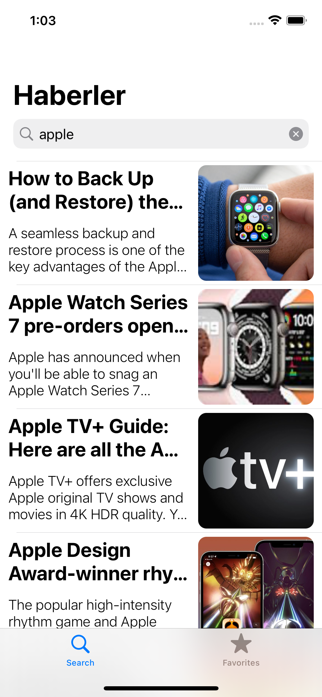
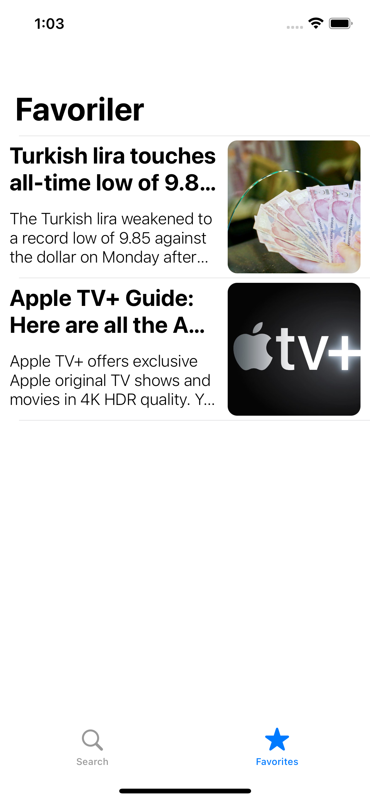
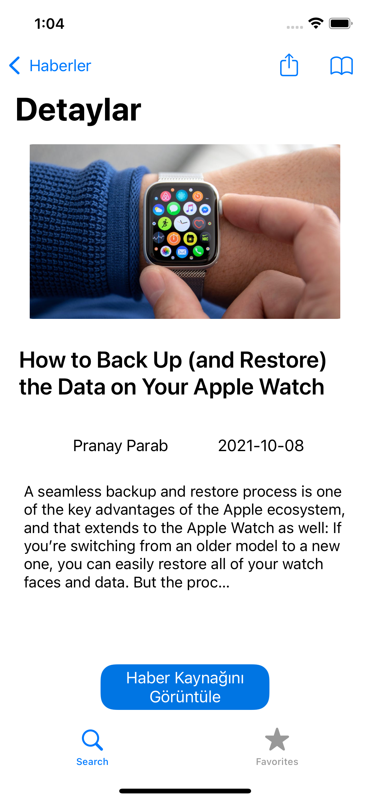
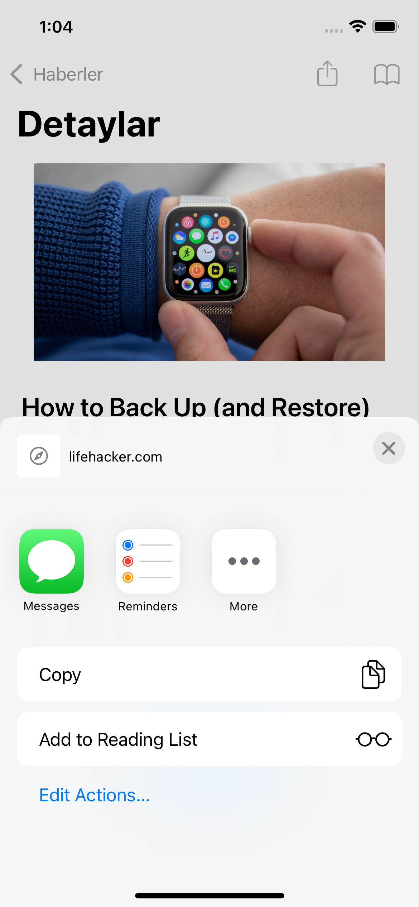
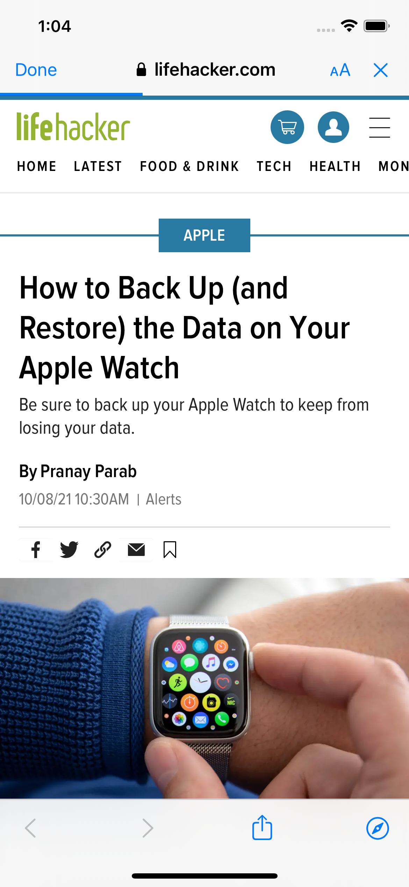

# News Feed App

- TabBarController'ımızın ilk tabında "newsapi.org"dan gelen veriyi kullanıcıya gösteriyoruz. Başlangıç url'indeki sonuçları gösteren sayfada search bar aracılığıyla istediğimiz anahtar kelimeyi aratarak ilgili sonuçları da tablomuzda görebiliriz.
    - Bu verilerin "newsapi.org"dan alınması için **URL Session** kullandım.

- Bu tabloda listelenen her bir haber için dokunduğumuzda segue yardımı ile haberin detaylarını görebileceğimiz farklı bir sayfaya yönlendiriliyoruz. Bu sayfada haberin ayrıntılarını görebilirken ayrıca üç farklı buton da görüyoruz. **Paylaşma, Favorilere Ekle** ve **Haberin Kaynağını Görüntüle** butonları burada yer alıyor.
    - Burada ise "paylaş" butonumuz için**activityViewController**; favorilere eklemek ve bu favorilere eklenen datayı local data'da tutabilmek için bir açık kaynak kütüphanesi olan **Realm**; son olarak haberin kaynağını görüntüleyebilmek için ise bir **WebView** kullandım. Favorilere ekleme tuşundan sonra ise kullanıcıyı bilgilendirmek için bir toast message kütüphanesi kullandım.

- Kullandığım **Realm** kütüphanesi ile local datada sakladığım verileri ise TabBarController'ın ikinci tabı olan Favoriler kısmında yine bir tablo ile listeledim.

## Uygulama Görüntüleri

